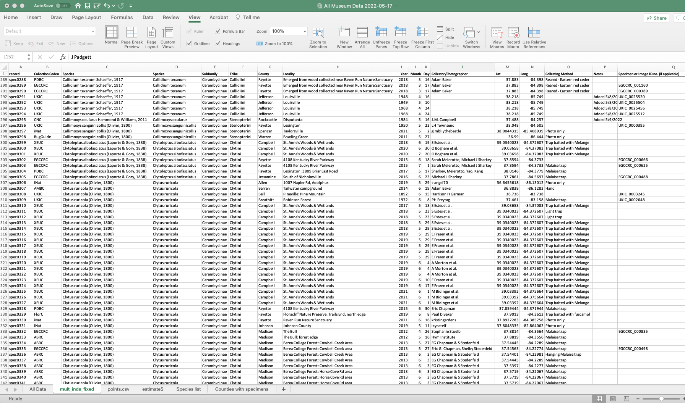
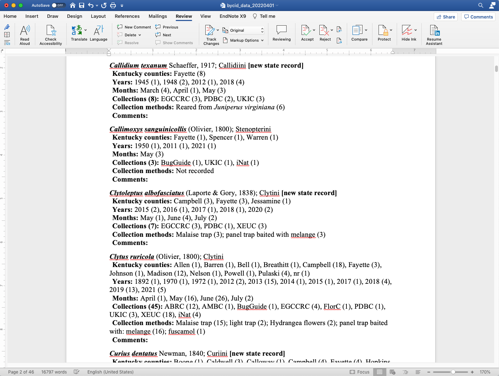
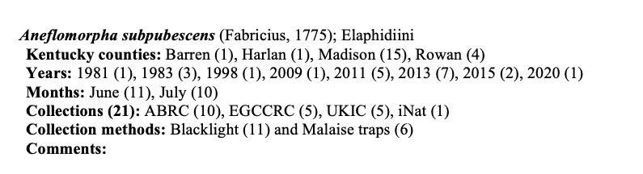

# Formatting species checklists with rtf

This repo houses code and scripts used to take an excel spreadsheet of specimen records and extract/format the data into a formatted species checklist. We generated this approach to facilitate creating a checklist of the Cerambycidae of Kentucky. i.e., this approach takes advantage of some simple for loops, unix commands, and rich-text formatting and lets you go from this:



to this:



### The general steps in this process are:
1. Create a spreadsheet containing specimen records (species identifications, classifications, collection locality information, etc.)
2. Create a unique species list to be used in subsequent steps
3. Using the unique species list, query the specimen spreadsheet, tabulating the number of specimens for unique parameters (e.g. up above we wanted the number of specimens per county, year, month, collection, and collection method)
4. Combine these tabulated lists into a new spreadsheet containing species records
5. Use rich-text formatting in an excel concatenate function to add bolding, italics, line breaks, etc.
6. Manually edit and add to this raw, formatted checklist to create a final species checklist


## Step 1. Specimen record spreadsheet
This is a user-input file with various information on a per-specimen basis. For the cerambycids of KY, we generated this input from our own digitized specimens, specimen records from other collections, and aggregated records from SCAN/GBIF. See `bycid_data.txt` for an example of a tab-delimited text file version of this spreadsheet.

Note, this requires 1 row per specimen, so if a dataset contains a unique collection localities in each row and a column defining the number of specimens of a given species at that unique locality, the following could be used to replicate specimen records: 

```awk -F'\t' '{for(i=0;i<$17*1;i++)print}' prep1.txt > prep2.txt```

Here, row 17 contains the "number of specimens" value, and will replicate entire rows based on the value within that column (`bycid_data.txt` is actually the result of this process, so the No. specimens column is no longer accurate).

## Step 2. Unique species list
A list of unique species in the dataset is used in subsequent steps, and could be generated in excel, or using something like this for `bycid_data.txt`:

```awk -F'\t' '{print $3}' bycid_data.txt | tail -n +2 | awk -F' ' '{print $1"_"$2}' | sort | uniq > bycid_species_unique```

## Step 3. Tabulate parameter counts for each species
Then, for loops with some piped unix commands are used to take each unique species in the dataset and count the number of specimens for a given unique parameter in the dataset. For example, we wanted to tabulate for each species the number of specimens that were collected in each county in Kentucky and format that output ina  way to be used in the next step. County is column 9 in `bycid_data.txt`, and the following for loop will extract and tabulate the unique counts per county per species, and write them to new file called `list_counties`:

```for f in `cat bycid_species_unique `; do echo -n -e  $f'\t'; grep $f bycid_data.txt | awk -F'\t' '{print $9}' | sort | uniq -c | awk -F' ' '{print " "$2" ("$1")"}' | tr "\n" ","| sed -e 's/.$//'; done > list_counties```

which generates a list like this:

```
$ head list_counties 
Acanthocinus_nodosus	 Rockcastle (1)
Acanthocinus_obsoletus	 Fayette (1), Madison (1), Powell (1)
Acmaeops_discoideus	 Madison (1)
Aegomorphus_modestus	 Breathitt (1), Campbell (9), Fayette (1), Harlan (2), Hopkins (1), Madison (8), Montgomery (1), Rowan (3), Russell (1), Warren (1), Wolfe (2), nr (4)
Aegomorphus_quadrigibbus	 Anderson (1), Calloway (1), Campbell (13), Edmonson (1), Fayette (3), Henry (1), Hopkins (1), Jessamine (1), Laurel (2), Letcher (1), Madison (6), Mercer (1), Pulaski (1), Trigg (1), Warren (1)
Analeptura_lineola	 Breathitt (1), Bullitt (5), Caldwell (1), Campbell (6), Fayette (8), Franklin (1), Grant (1), Jefferson (1), Laurel (6), Letcher (1), Madison (18), Morgan (18), Owen (1), Powell (1), Rowan (44), Wolfe (1), Woodford (3), nr (1)
Aneflomorpha_subpubescens	 Barren (1), Harlan (1), Madison (15), Rowan (4)
Anelaphus_pumilis	 Barren (3), Bullitt (2), Campbell (54), Fayette (1), Madison (11), Powell (1), Trigg (1)
Anelaphus_villosus	 Barren (3), Bullitt (4), Caldwell (1), Campbell (4), Daviess (1), Fayette (11), Grayson (2), Harlan (3), Hart (1), Henry (1), Hopkins (3), Jefferson (24), Jessamine (1), Letcher (1), Madison (54), McCracken (1), Meade (2), Monroe (2), Morgan (1), Muhlenberg (2), Oldham (2), Powell (5), Pulaski (1), Robertson (1), Rowan (24), Shelby (1), Trigg (1), Warren (6), nr (1)
Anoplodera_pubera	 Fayette (1), Madison (3), Morgan (3), Rowan (3)
```

Identical for loops, except for the column being considered in the first `awk` and the output file name, were used to tabulate the number of specimens per county, year collected, month collected, collection method, and museum/collection housing the specimens. 

## Step 4. Species record spreadsheet
Now with tabulated counts and information for each species, these can be combined into a species record spreadsheet in excel or using unix (but since we take advantage of excel's concatenate function in the next step, might as well use excel). So now this spreadsheet should have 1 row per species, and any pertinent information (taxonomic authority, notes, etc.) can be added to this spreadsheet. 

## Step 5. Rich text formatting
The goal of the rich text formatting (rtf) portion of this approach is to avoid having to manually add italics, bold, punctuation, line breaks, etc. from the accumulated and tabulated information for each species. The Cerambycidae of Kentucky contained 222 species, leading to thousands of manual formatting edits that would be required in the final checklist. With some very basic rtf and a concatenation function it's relatively easy to automate this formatting for each species in the species record spreadsheet. For example, this line of rtf saved in a text file with the .rtf suffix:

```
{\rtf1\ansi\deff0 
{\pard {\i\b Aneflomorpha subpubescens} (Fabricius, 1775); Elaphidiini  \par} {\pard {\b Kentucky counties: }Barren (1), Harlan (1), Madison (15), Rowan (4) \par} {\pard {\b Years: }1981 (1), 1983 (3), 1998 (1), 2009 (1), 2011 (5), 2013 (7), 2015 (2), 2020 (1) \par} {\pard {\b Months: }June (11), July (10) \par} {\pard {\b Collections (21): }ABRC (10), EGCCRC (5), UKIC (5), iNat (1) \par} {\pard {\b Collection methods: }Blacklight (11) and Malaise traps (6) \par} {\pard {\b Comments: }\sa180 \par}
}
```
looks like this when opened in Word:


Thus, rtf formatting elements specifying new lines, bold, italics, etc. can be integrated into a concatenate function in excel to create formatted records for every species in the database. There are a lot of formatting options in basic rtf (see for example [the rtf pocket guide](https://www.oreilly.com/library/view/rtf-pocket-guide/9781449302047/ch01.html) for details), but the most pertinent ones are:
```
{\rtf1\ansi\deff0        # required as the first line of the rtf file (header)
}                        # required as the last line of the rtf file (footer)

{   }                    # curly brackets need to enclose each unique format and/or text
{\pard                   # inserts new line
/par}                    # ends new line

\i                       # italic
\b                       # bold text
\i\b                     # these can be combined for italics and bold

```

See [example_bycid_rtf_formatting.xlsx](example_bycid_rtf_formatting.xlsx) for an example of adding these to a concatenate function in excel. If the contents of column S (cells S2:S218) are pasted into a text file with the rtf header and footer as first and last line and saved as .rtf format, most contemporary word processor softwares (e.g. Microsoft Word) will interpret the rtf as the second image at the top of this readme. For the Cerambycidae of Kentucky, we used this method to create the raw, formatted checklist, and then added the "comments" field for each species manually. 
